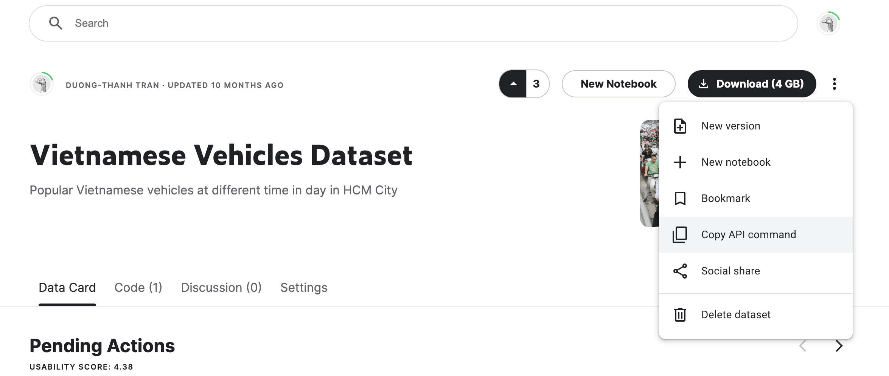

## Useful snippets for Google Colaboratory

### Install conda easily
```python
!pip install -q condacolab
import condacolab

# install standard conda
condacolab.install()

# install miniconda
condacolab.install_miniconda()
```
Other conda distributions: https://github.com/conda-incubator/condacolab

### Download kaggle dataset
```python
!pip install -q kaggle
from google.colab import files
files.upload()
!mkdir ~/.kaggle
!cp kaggle.json ~/.kaggle/
!chmod 600 ~/.kaggle/kaggle.json
```
- ```kaggle.json``` is generated from `Account -> API -> Create New API Token`. Aftering upload the file.
- Copy the API command of the dataset to download.
```python
!kaggle datasets download -d <username>/<dataset_name>
```


### Download GGDrive folder if folder is shared but can't be downloaded
*No working anymore*
```python
!pip install gshell
!gshell pwd
#####################
def download_gdrive_folder(id_folder, root_path=''):
  os.system(f'gshell cd --with-id {id_folder}')
  with os.popen('gshell ll') as f:
    _ = f.readline()
    for line in f.readlines():
      # print(line)
      id = line[:line.index('  ')]
      
      line = line[line.index('  '):].lstrip()
      name = line[:line.index('  ')]

      line = line[line.index('  '):].lstrip()
      type_file = line[:line.index('  ')]
      
      if type_file == 'dir':
        download_gdrive_folder(id, os.path.join(root_path, name))
      else:
        if not os.path.exists(root_path):
          os.makedirs(root_path, exist_ok=True)
        
        file_path = os.path.join(root_path, name)
        print(f'Downloading: {id} - Path: {file_path}')
        print('-------')
        gdown.download(id=id, output=file_path)
        print('\n\n\n\n\n')

#############
download_gdrive_folder('<gg_drive_folder_id>', root_path='<root_folder>')
```

### Mount outside GG Drives
```python
!sudo add-apt-repository -y ppa:alessandro-strada/ppa 2>&1 > /dev/null
!sudo apt-get update -qq 2>&1 > /dev/null
!sudo apt -y install -qq google-drive-ocamlfuse 2>&1 > /dev/null
!google-drive-ocamlfuse

!sudo apt-get install -qq w3m # to act as web browser 
!xdg-settings set default-web-browser w3m.desktop # to set default browser
%cd /content
!mkdir drive
%cd drive
!mkdir MyDrive
%cd ..
%cd ..
!google-drive-ocamlfuse /content/drive/MyDrive
%cd /content
```

### Download multiple files with requested headers
```python
!wget --header="..." --header="..." -i "file_contained_links"
```

### Download google drive file using cURL
Using this if you have issue with many accesses.
```
!curl -L -s -o <path_to_saved_file> 'https://drive.google.com/uc?id=<ggdrive_id>&confirm=t'
```

